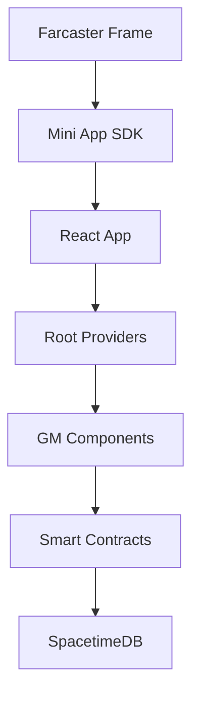

# OnePulse


## Daily GM Tracking on Multiple Blockchains

A Farcaster Mini App for saying "GM" daily across Base, Celo, and Optimism networks

---

## ✨ Overview

OnePulse is a Base app/Farcaster Mini App that lets users say "GM" (Good Morning) daily across multiple blockchain networks, track their streaks, and earn DEGEN token rewards. Built with modern Web3 technologies, it demonstrates seamless integration between Farcaster, smart contracts, and real-time databases.

### 🚀 Key Features

- **Multi-Chain GM Tracking** - Say GM on Base, Celo, and Optimism
- **Real-Time Streaks** - Track current and highest streaks
- **DEGEN Rewards** - Automatic token rewards for daily participation
- **Farcaster Integration** - Native Mini App experience
- **Live Statistics** - Real-time updates via SpacetimeDB

---

## 🛠 Tech Stack

| Category | Technology | Version |
|----------|------------|---------|
| **Frontend** | Next.js, React, TypeScript | 16.0, 19.0, 5.0 |
| **Styling** | Tailwind CSS | 4.1 |
| **Web3** | OnchainKit, Wagmi, Viem, AppKit (Reown) | latest, 2.19, 2.38, 1.8.14 |
| **Database** | SpacetimeDB | 1.7 |
| **Farcaster** | MiniApp SDK | 0.2.1 |
| **UI** | Radix UI, Motion | latest |

---

## 📁 Project Structure

```text
app/                   # Next.js App Router
├── api/               # API routes (auth, gm, claims)
├── layout.tsx         # Root layout
├── page.tsx           # Main app page
└── globals.css        # Global styles

components/            # React components
├── gm-chain-card/     # Per-chain GM UI
├── providers/         # Context providers
├── ui/                # Reusable UI components
└── ...

contracts/            # Solidity smart contracts
hooks/                # Custom React hooks
lib/                  # Utilities and configurations
server/               # Rust/SpacetimeDB backend
```

---

## 🚀 Quick Start

### Prerequisites

- Node.js 18+ or Bun
- Coinbase Developer Platform account
- Farcaster account

### Installation

```bash
# Clone repository
git clone https://github.com/nirwanadoteth/onepulse.git
cd onepulse

# Install dependencies
bun install

# Configure environment
cp .env.example .env.local
# Edit .env.local with your API keys

# Start development server
bun dev
```

Visit `http://localhost:3000` to see the app.

### Environment Setup

```bash
# Required environment variables
NEXT_PUBLIC_ONCHAINKIT_API_KEY=your_cdp_api_key
NEXT_PUBLIC_ONCHAINKIT_PROJECT_ID=your_cdp_project_id
NEXT_PUBLIC_REOWN_PROJECT_ID=your_reown_project_id
NEXT_PUBLIC_URL=http://localhost:3000

# Smart contract addresses
NEXT_PUBLIC_DAILY_GM_ADDRESS_BASE=0x...
NEXT_PUBLIC_DAILY_GM_ADDRESS_CELO=0x...
NEXT_PUBLIC_DAILY_GM_ADDRESS_OPTIMISM=0x...
NEXT_PUBLIC_DAILY_REWARDS_ADDRESS_BASE=0x..

# Database
SPACETIMEDB_HOST_URL=
SPACETIMEDB_MODULE=

# Redis
KV_REST_API_URL=
KV_REST_API_TOKEN=

# Signer PK
BACKEND_SIGNER_PRIVATE_KEY=0x
```

---

## 🏗 Architecture

### Data Flow



### Key Components

- **Server Components** - Data fetching and static content
- **Client Components** - Interactive UI and wallet connections
- **Custom Hooks** - Reusable logic for GM stats, connections
- **Context Providers** - Global state management

---

## 📊 Features

### Daily GM Tracking

- One GM per UTC day per network
- Automatic streak calculation
- Real-time statistics updates

### Multi-Chain Support

- **Base** - Ethereum L2 with low fees
- **Celo** - Mobile-first blockchain
- **Optimism** - Optimistic rollup

### Reward System

- DEGEN token rewards
- Automatic claiming
- Reward history tracking

---

## 🧪 Development

### Available Scripts

```bash
bun dev              # Start development server
bun run build        # Build for production
bun typecheck        # Run TypeScript checks
bun check            # Run ultracite check
bun format           # Format code with ultracite
```

### Code Quality

The project maintains high code quality with:

- **TypeScript strict mode** enabled
- **Biome** lint and format tools with ultracite settings
- **Automated import sorting**

### Naming Conventions

- Components: `PascalCase` (UserCard)
- Hooks: `camelCase` with `use` prefix (useGmStats)
- Utilities: `camelCase` (normalizeChainId)
- Constants: `UPPER_SNAKE_CASE` (API_TIMEOUT)

---

## 🚢 Deployment

### Vercel Deployment

```bash
bun run build
vercel --prod
```

### Mini App Configuration

1. Deploy to production domain
2. Generate signed manifest at [Farcaster Manifest Tool](https://farcaster.xyz/~/developers/mini-apps/manifest)
3. Update `minikit.config.ts` with signed `accountAssociation`
4. Redeploy

### Environment Variables

Set production environment variables in your hosting platform:

- `NEXT_PUBLIC_ONCHAINKIT_API_KEY`
- `NEXT_PUBLIC_ONCHAINKIT_PROJECT_ID`
- `NEXT_PUBLIC_URL` (production domain)
- Smart contract addresses

---

## 📚 Documentation

### 📖 Guides

- [Architecture Overview](app/README.md)
- [Farcaster MiniApp Checklist](.github/instructions/farcaster-miniapps.instructions.md)
- [OnchainKit Best Practices](.github/instructions/onchainkit.instructions.md)
- [Performance Optimization](.github/instructions/performance-optimization.instructions.md)
- [Security Guidelines](.github/instructions/security-and-owasp.instructions.md)

### 🏗 API Reference

- [Smart Contracts](contracts/) - DailyGM.sol, DailyRewards.sol
- [Component Library](components/ui/) - Reusable UI components
- [Hooks Reference](hooks/) - Custom React hooks

---

## 🤝 Contributing

We welcome contributions! Please follow these steps:

1. **Fork the repository**
2. **Create a feature branch** (`git checkout -b feature/amazing-feature`)
3. **Make your changes** following our coding standards**
4. **Run quality checks** (`bun check`)
5. **Commit your changes** (`git commit -m 'feat: add amazing feature'`)
6. **Push to the branch** (`git push origin feature/amazing-feature`)
7. **Open a Pull Request**

### Development Guidelines

- Follow TypeScript strict mode
- Use functional components with proper typing
- Implement proper error handling
- Add comments for complex business logic
- Update documentation for new features

---

## 🐛 Troubleshooting

### Common Issues

#### Manifest Not Loading

```bash
# Check manifest is accessible
curl https://your-domain/.well-known/farcaster.json
```

#### App Not Initializing

Ensure `sdk.actions.ready()` is called in your Mini App initialization.

#### Transaction Failures

- Verify wallet is connected to correct network
- Check sufficient balance for gas fees
- Confirm smart contract addresses are correct

#### Database Connection Issues

- Verify SpacetimeDB endpoint accessibility
- Check subscription queries are properly formatted
- Ensure event handlers are correctly configured

> **Note:** For detailed troubleshooting, see our [Farcaster MiniApp Checklist](.github/instructions/farcaster-miniapps.instructions.md).

---

## 🔗 Links

- [🌐 Live Demo](https://onepulse.nirwana.lol)
- [📖 Farcaster Documentation](https://docs.farcaster.xyz)
- [🔗 Reown AppKit](https://docs.reown.com)
- [🛠 OnchainKit](https://onchainkit.xyz)
- [📚 Next.js Docs](https://nextjs.org/docs)
- [🎨 Tailwind CSS](https://tailwindcss.com)

---

## ⚠️ Disclaimer

**This is a live Farcaster Mini App accessible through Farcaster clients and Base app, as well as via web browsers.**

Use at your own risk. This application interacts with blockchain networks and may involve financial transactions.

---

## Built with ❤️ using Next.js, React, OnchainKit, and Reown AppKit

⭐ [Star us on GitHub](https://github.com/nirwanadoteth/onepulse) • 🐛 [Report Issues](https://github.com/nirwanadoteth/onepulse/issues)
